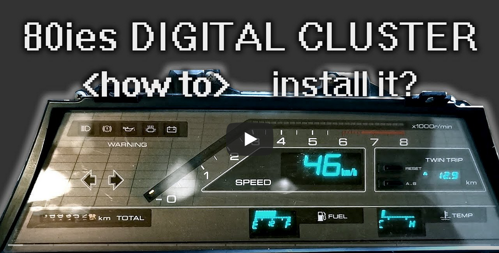
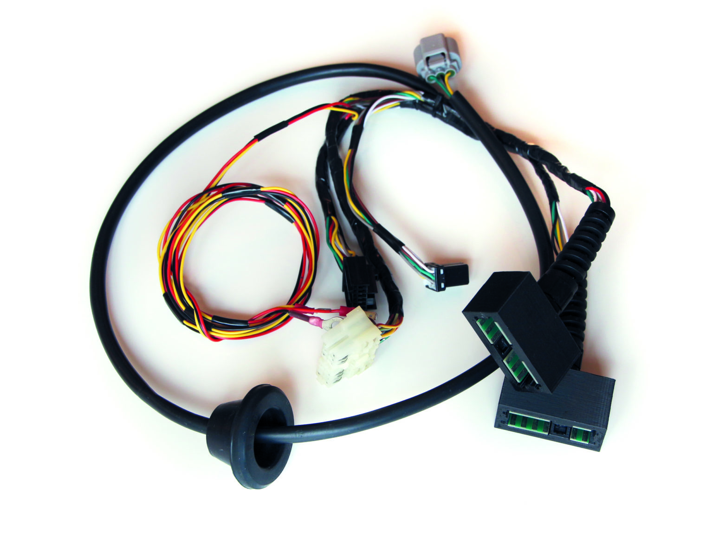
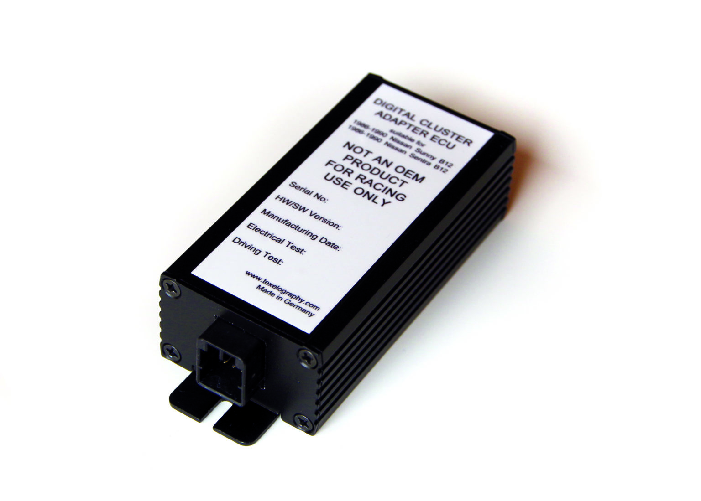

# Nissan Sunny Rz1 Digital Cluster Conversion Project

## Status




This picture shows a digital cluster for the Nissan Sunny B12 Rz1 model, built from 1986 to 1990.
This digital cluster was exclusive for the Japanese market, and only sold in very few cars. All export models were equipped with a more traditional instrument cluster using dials and pointers.
There is no easy way to install the digital cluster into the export models - the connectors and signals are different.

That is why I have built an adapter, that can be plugged in to the vehicle harness, and allows installation of the digital cluster in your car.



This harness allows installing a JDM digital cluster into a LHD EUDM/USDM Nisssan Sunny B12. It hooks between the vehicle harness and the digital cluster and converts the signals.

Adapting the cables and connectors only is not sufficient. Some signals need to be translated. For this, the adapter comes with a small conversion ECU. 



This ECU takes care of the signal translations, so that the digital cluster displays the correct values. This repository contains the firmware for this ECU.

## Conversion Details

The firmware takes care to convert the following vehicle signals:

* The standard fuel sensor signal doesn't match to the one the digital cluster expects. The standard fuel sensor is resistor based, while the digital cluster expects a voltage signal. This SW cyclically reads out the current fuel sensor resistor on the ADC, converts it into a voltage, and then provides the correct voltage to the digital cluster using the DAC.
* The speed signal of the standard cluster is provided mechanically, using a speedometer cable connected to the transmission. The digital cluster expects the vehicle speed as a digital PWM signal. To make this work, the adpater kit comes with a sensor that mounts to the gearbox, and provides a digital signal. The PWM generated by this sensor is read by the ECU. It is then multiplied to match the correct frequency the digital cluster expects, and provided to the cluster.

For more details, please check my homepage under [www.texelography.com](http://texelography.com/2021/03/11/nissan-rz1-digital-cluster-conversion-will-be-available-starting-of-apr-2021/).

To run this, you will need the ECU PCB, which uses the STM32F303CCT6 MCU. [The schematics and part list are available on my homepage.](http://texelography.com/2022/10/23/nissan-sunny-rz1-digital-cluster-adapter-schematics-and-cad/)

## SW Architecture

The SW was developed with a platform architecture in mind, that can be reused for other vehicle projects. As such, it features a full embedded software architecture with embedded OS, debug interface, middleware and application. The Operating System is FreeRTOS, with a custom middleware built on top of the STM32 hardware libraries.

It even supports a CAN stack, although the Sunny Rz1 does not come with a CAN bus, but it makes it easier to support other newer vehicle platforms.

A rich set of debug applications are also provided, providing error logging and persistent error logging, sensor debug logging, and playback of demo curves.

## Toolchain

The application is written in C++20 and uses CMake as the build platform. The compiler from the STM32 toolchain can be conveniently executed using Docker.

## How to Build?

You do not need to install any toolchain; the environment is provided by using docker. The docker container provides the tools and compiler required to build the firmware.

Run 
```
./run_docker.sh
```
to start the STM32 build environment docker container, and get the tool environment.

To generate CMake for a release configuration, please execute
```
./run_cmake.sh
```
If you want to build a debug variant, just execute instead:
```
./run_cmake_debug.sh
```

Afterwards, just build using
```
make
```
The binaries will be generated in bin_Release or bin_Debug.

If you don't want to install any tooling, you can also simply trigger the GitHub actions, which will do a clean firmware build. You can download the binary build directly from the GH action.